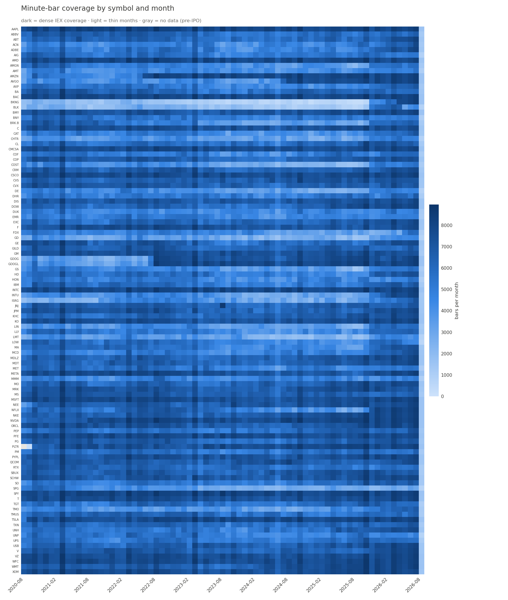

# 01 — The data

*What we downloaded, what we dropped, and what we know is imperfect.*

## Sources

| Table | Source | Coverage | Why this source |
|---|---|---|---|
| `bars` (1-min OHLCV + trade count + VWAP) | Alpaca Market Data API, free tier (IEX feed) | Aug 2020 → present, 105 symbols (S&P 100 + SPY) | Only free, scriptable source of minute-level US equity history |
| `daily` (daily OHLCV) | Yahoo Finance via `yfinance` | 2018 → present | Beta regressions need ~1.5 years of daily returns *before* the first minute bar |
| `factors` (MKT−RF, SMB, HML, WML, RF) | [Ken French Data Library](https://mba.tuck.dartmouth.edu/pages/faculty/ken.french/data_library.html) | Nov 1926 → present (monthly refresh lag) | The canonical factor source; WML from the separate momentum file |

Empirical findings baked into the download scripts (`python/ingest/`):

- **Alpaca's free history is a rolling ~6-year window.** Probed by bisection on
  2026-08-07: requests before ~Aug 2020 return empty, for both minute and daily bars.
- **The IEX feed is ~2.5% of US volume.** Prices track the consolidated tape closely for
  large caps (arbitrage keeps venues aligned); **volumes are unrepresentative**. Rule:
  volume may only ever be used *relative to the same stock's own IEX history*.
- **Stooq (the original daily source) blocks scripted downloads** behind a JS
  browser-verification wall — hence Yahoo.
- Daily prices are **dividend-and-split adjusted** (total-return); minute prices are
  **split-adjusted only**. Fine, because the two tables serve different jobs (returns
  regressions vs. intraday moves) and are never mixed on the same horizon.

## Cleaning (q/clean.q), with receipts

From the last full load (`data/reports/clean_report.csv`):

| Rule | Rows dropped | Comment |
|---|---|---|
| Outside 09:30–15:59 ET | 90,943 (~0.2%) | IEX minute data is essentially RTH-only already |
| Duplicate (sym, minute) | 0 | none observed — kept as a guard |
| high < low | 0 flagged | data-quality tripwire |

Final table: **45,568,885 bars**, 1,509 trading days (2020-08-03 → 2026-08-06), zero
weekend rows. Timezone conversion (UTC → New York) implements the US DST rule directly —
see the war stories below.

Cross-source sanity check: SPY's daily return correlates **0.9948** with Ken French's
market factor over 2,133 shared days. Three independent pipelines agreeing is the
strongest evidence the data layer is sound.

## Coverage

Readable stories in this one picture:

- **BLK's pale stripe** — BlackRock is a ~$900/share stock that trades thinly on IEX.
  Its bar coverage (and therefore its volume features) will be noisy. Expect a handful
  of such names; the strategy's ranking approach tolerates it.
- **GOOG/GOOGL darken abruptly in July 2022** — the 20-for-1 split. Cheaper shares →
  more trades per minute → more bars with prints. (Prices are split-adjusted; *activity*
  is not, and shouldn't be.)
- **PLTR is gray before Oct 2020** — IPO'd Sept 30, 2020. Real absence, not missing data.
- **The last column is pale** — the current month is partial. Not a bug.

## Known imperfections (also see PLAN.md §7)

1. **Survivorship bias**: the universe is the S&P 100 *as of 2026-08-07*. Fallen members
   are absent, which flatters backtests. Measured and disclosed, not fixed.
2. **BNY Mellon renamed BK → BNY** (both Alpaca and Yahoo serve full history under BNY).
   Ticker renames are routine; the universe file records the observation date for
   exactly this reason.
3. **One-symbol partial partitions**: BNY's bars were fetched during a live session,
   creating a partial "today" partition no other symbol had. Deleted; a full refresh
   re-creates it consistently. Lesson: never mix download vintages inside one partition.

## War stories (read these — they're the point)

Three bugs found while loading, all silent-but-wrong until checked against source:

1. **A bare `/` line in a q script opens a block comment.** Entire files "loaded"
   while defining nothing.
2. **q evaluates right-to-left with no operator precedence.** `ts - 0D05 + 0D01*dst`
   is `ts - (0D05 + 0D01*dst)` = −6h, not (−5h)+1h. Every summer bar shifted; the data
   looked perfectly plausible. Caught only by comparing the loaded 09:30 bar against
   the raw CSV. Parentheses in `q/clean.q` are marked load-bearing.
3. **`.DS_Store` files** (dropped by macOS Finder into any browsed folder) corrupt
   q directory scans. The loader now accepts only directories; `make hdb` sweeps first.

Moral: a pipeline that runs green is not a pipeline that's right. Verify output
against source after every transformation.
