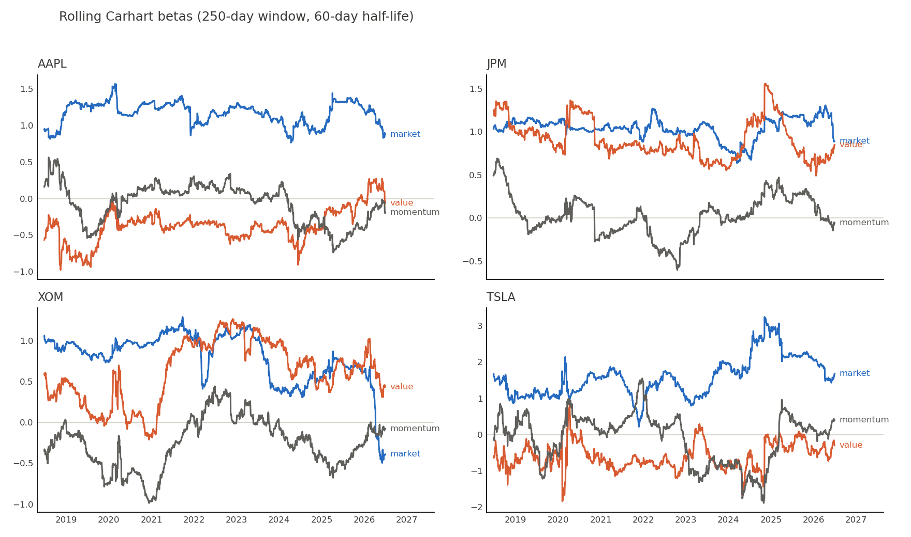

# 03 — The factor model layer

*Turning "TSLA moved 3%" into "1.5% was the market, 1.5% was TSLA."*

## What gets computed

For every stock, every day: the **Carhart 4-factor betas** — sensitivities to the
market (MKT−RF), size (SMB), value (HML), and momentum (WML) factor portfolios.
Downstream, these do three jobs: strip factor-driven movement out of intraday
returns (Phase 4), constrain the portfolio to zero net factor exposure (Phase 6),
and attribute the final P&L (Phase 7).

## The regression (cpp/src/rolling_beta.cpp)

Daily excess returns on the four factors, per stock, per day, over a trailing
window:

$$r_{i,\tau} - r_{f,\tau} = \alpha_i + \beta^{MKT}_i MKT_\tau + \beta^{SMB}_i SMB_\tau + \beta^{HML}_i HML_\tau + \beta^{WML}_i WML_\tau + \varepsilon_\tau$$

solved in closed form as weighted least squares with ridge damping:

$$\hat\beta = (X^\top W X + \lambda I)^{-1} X^\top W y$$

| Choice | Value | Why |
|---|---|---|
| Window | 250 trading days | a year of context |
| Weighting | exponential, **60-day half-life** | betas drift with regimes; last week ≈ 8× the weight of five months ago |
| Ridge λ | 1e-4 | guards near-singular quiet windows; ~1–3% shrinkage on factor terms |
| Min. history | 120 days | don't pretend to know a beta you can't estimate |

The cost of the 60-day half-life is *noise* (effective sample ≈ 87 days); the
benefit is betas that track regime shifts quickly. The figure shows both properties.



Reading the panels: **JPM**'s HML loading is persistently positive (banks are the
canonical value stock) while **AAPL**'s is persistently negative (canonical growth) —
the model rediscovers common knowledge from prices alone, which is exactly the sanity
check you want. **XOM** shows regime dependence: HML surges through the 2021–22 energy
rally. **TSLA** is why position caps exist: market beta between 1 and 3, momentum
loading swinging ±1.5.

## Architecture: who does what

```
q server (serve.q, port 5001)          C++ engine (main_betas)
─────────────────────────────          ─────────────────────────────
join daily returns x factors    ─IPC→  parse 223k rows into per-sym blocks
                                       210,475 WLS fits (Eigen, 0.9s)
persist betas into the HDB     ←IPC─   upload native K table (no CSV!)
```

The division is deliberate: q does the joins (its home turf), C++ does the numeric
loop (its home turf), and the wire between them is q's own binary IPC via the KX C
API — `cpp/include/kdb_conn.hpp` wraps that API's sharp edges (manual refcounts,
errors-as-values) into RAII and exceptions. Fun fact: KX's `m64/c.o` is secretly a
universal binary, so this links natively on Apple Silicon.

## Verification (the part that earns trust)

1. **SPY as the known answer**: the S&P ETF must read β_mkt≈1, others≈0, R²≈0.99.
   Result: 0.957 / ≈0 / 0.985 with the 60-day weighting (0.987 unweighted). ✓
2. **Independent referee**: numpy re-implementation from the raw CSVs matches the
   C++ output to six decimals. ✓
3. **Distribution check**: median R² 0.43 across 210k fits — right where daily
   single-name factor regressions live. ✓

## The war story: the label shift

The first working run produced betas where **AT&T wore SPY's numbers** — every
symbol's results were attached to the alphabetically-next symbol. The hunt, in order:
numpy referee said the data was fine; q's own `lsq` said the panel was fine; a C++
dump said the fetch was fine; a `fit_all` dump said the math was fine; an isolated
upload said *that* was fine — at which point the identical binary produced correct
results. Root cause: a **stale CMake object file** from a mid-edit compile had been
linked into the earlier runs. Two morals: (1) when compiled code behaves impossibly,
`rm -rf build` before doubting your math; (2) none of this is findable without an
independent referee and stage-by-stage bisection.

Also collected here: `\l data/hdb` **cd's the process into the HDB**, so server-side
writes target `` `:. ``; partitioned tables can't aggregate the virtual date column
(use `.Q.pv`); `select` first, aggregate the in-memory result second.

Next chapter: [04 — the signal](04_signal.md) (Phase 4/5).
