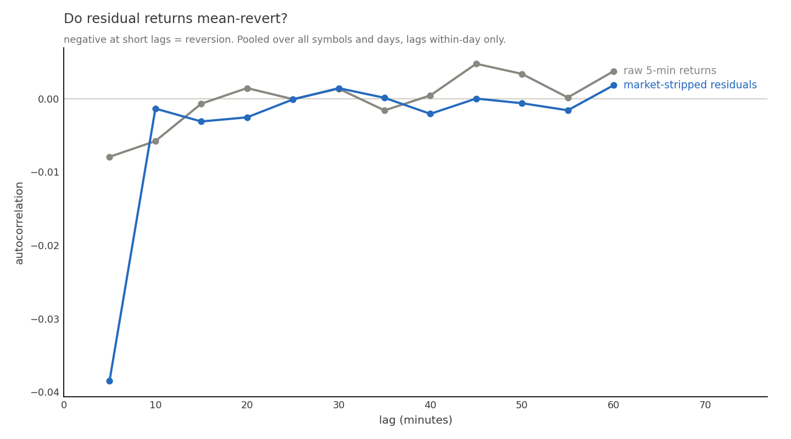

# 04 — The signal

*Does anything here predict anything? Measured honestly: yes, a little, and
linear regression captures all of it.*

## The hypothesis and its first test

Idiosyncratic (factor-stripped) intraday moves should mean-revert; factor-driven
moves shouldn't. Phase 4 built the residual (`sig` table, [chapter 03](03_factor_model.md)
for the beta layer) and asked the data directly:

Residual returns autocorrelate at **−0.038** at the 5-minute lag vs **−0.008** for raw
returns — stripping the market deepens measurable reversion ~5×, exactly what the
factor architecture predicts. Two caveats registered *before* the backtest:
the signal dies by ~15 minutes (so the original 30-minute label was retired in favor
of `fwdres10`), and part of short-lag reversion is bid-ask bounce that costs will eat.

## Features (q/features.q) and validation design

Seven features per (stock, 5-min bucket): `z30`, `z60` (trailing residual moves
scaled by the stock's own realized vol — "how stretched, in its own units"), log
realized vol, log **relative** volume surprise (relative because IEX volumes are
unrepresentative), clipped overnight gap, and open/close-hour dummies.

Look-ahead discipline: betas joined as-of (strictly prior day), volume baselines
exclude the current day, labels are forward sums nulled where the window would
cross the close. Validation: **yearly expanding walk-forward with a 5-trading-day
embargo** (python/validation/purged_cv.py) — random K-fold would leak forward
labels into training and silently inflate every number.

## Results

OLS baseline (02_baseline_ols.py), across 6 test years 2021–2026, three horizons:

| Label | mean OOS R² | mean rank IC | mean IC t |
|---|---|---|---|
| **fwdres10** | **0.00017** | **0.0223** | **9.8** |
| fwdres15 | 0.00012 | 0.0213 | 8.4 |
| fwdres30 | 0.00004 | 0.0193 | 6.3 |

- The `z30` coefficient is **negative in all 18 fits**: stretched stocks revert.
- The horizon gradient matches the autocorrelation plot: the signal is fastest at
  10 minutes. Data over plan: `fwdres10` is the primary label.
- Positive IC in **every fold of every year**, t-stats 3.7–13.1 — consistent skill,
  not a single-regime artifact.
- **Alpha decay is visible and disclosed**: 2021–23 folds are stronger than
  2024–26 (fwdres10 IC: 0.024–0.030 early vs 0.011–0.022 late).

Magnitude intuition: IC ≈ 0.022 per rebalance sounds tiny; applied ~78 times a day
across ~100 names, breadth compounds it (Grinold's fundamental law). Whether it
survives *costs* is Phase 6's question, not this chapter's.

## OLS vs MLP: the pre-registered fight

The MLP (03_mlp.py): 2×32 hidden units, dropout, early stopping on a
validation slice of the training years — on **identical features, folds, and
metrics** (enforced by common.py), so any win could only come from nonlinearity.

| mean across folds | OLS | MLP |
|---|---|---|
| rank IC | **0.0223** | 0.0209 |
| OOS R² | **0.000168** | 0.000148 |
| IC t | **9.79** | 9.69 |

**The MLP does not beat OLS.** It is marginally worse everywhere. Verdict, stated
plainly: *with these seven features at this signal-to-noise ratio, the
predictive relationship is essentially linear; the network's extra capacity buys
variance, not insight.* This is a common and legitimate finding in cross-sectional
equity prediction — nonlinear models start paying when features multiply into the
dozens and interactions matter. Reporting it beats hiding it.

**Consequence for Phase 6:** the production signal is the OLS model — simpler,
auditable, and it ports to the C++ backtester as a 8-number dot product.

Next chapter: [05 — the backtest](05_backtest.md).
