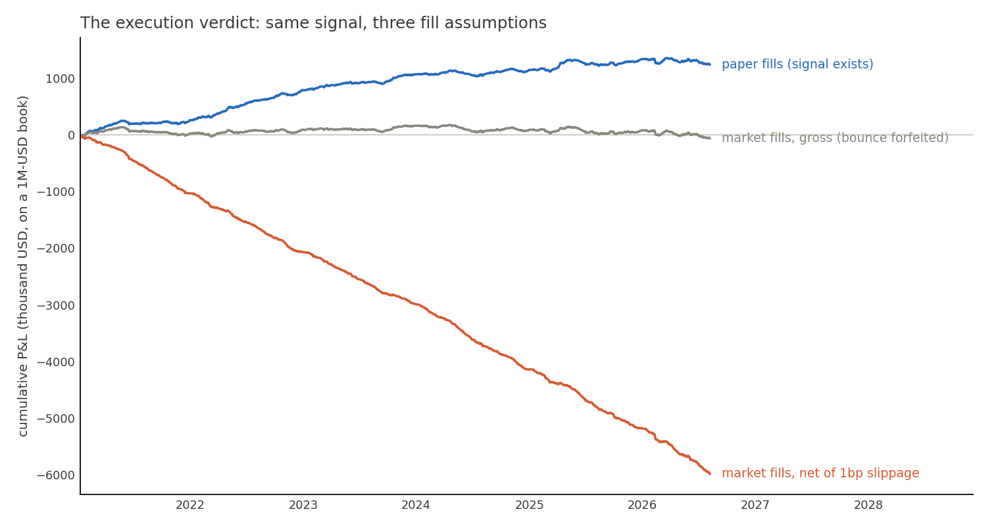
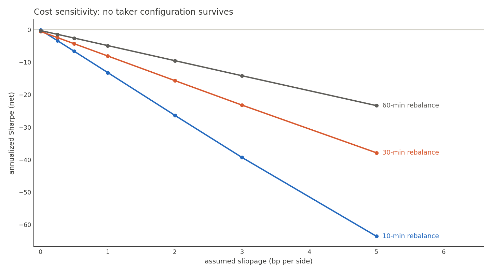

# 05 — The backtest

*The referee. Everything before this chapter measured the signal; this one
measures whether anyone gets paid.*

## Mechanics (cpp/src/backtester.cpp)

Event-driven simulation over every prediction day (2021 → present, all
out-of-sample — each year predicted by a model trained only on prior years):

- **Decisions** every 2nd five-minute bucket (matching the 10-minute horizon):
  rank all stocks by predicted forward residual; long the top 10, short the
  bottom 10, ~$50k per name (~$1M gross book).
- **Hysteresis bands**: enter at rank ≤ 10, exit only past rank 25 — borderline
  names don't churn every rebalance.
- **Beta neutrality**: the short leg is scaled by the ratio of the legs' summed
  market betas, so the book's net market exposure ≈ 0 at every rebalance.
- **Fills at the NEXT bucket's open** — never the price the decision saw.
- **Flat by the close** — intraday only; the overnight gap is information
  (a feature), never risk.
- **Costs**: SEC fee (sell notional × 27.8e-6), FINRA TAF ($0.000166/share
  sold, capped), and slippage priced at 0/0.5/1/2/5 bp per side. Because
  targets don't depend on fills, net P&L is *linear* in the slippage rate:
  one simulation prices every scenario exactly.
- **Paper-fill mode**: fills at the decision price itself — unattainable, but
  it makes the decomposition below possible.

## Results

| Config | Turnover/day | Gross/day | Gross Sharpe |
|---|---|---|---|
| Paper fills, 10-min | $43M | **+$904** | **+2.58** |
| Market fills, 10-min | $43M | −$45 | −0.14 |
| Market fills, 30-min | $21M | −$159 | −0.57 |
| Market fills, 60-min | $11M | −$69 | −0.29 |

**The decomposition** (the finding of the project): the ~$950/day gap between
paper and market fills is the **bid-ask bounce** — a stock that ranks "stretched
down" typically printed its last trade at the bid; the next bar's first trade is
back near mid, and that bounce *was* most of the predicted reversion. Measured
signal ≈ execution toll, almost to the dollar.

**Why trading slower doesn't help**: turnover falls 4× but gross stays ~zero —
figure 04 already showed the signal is dead past ~15 minutes, so longer holds
collect nothing extra while still paying the toll at entry.

## Assumptions honestly stated

- Fills at IEX bar opens, full size, no partial fills or market impact beyond
  the slippage rate (at $50k clips in S&P 100 names, impact is second-order
  next to the spread).
- IEX prices proxy the consolidated tape (good for large caps; §01).
- No borrow costs on shorts (large-cap general collateral ≈ small vs the toll
  that already decides the verdict).
- Betas from the daily layer, previous day's estimate (no look-ahead).

None of these assumptions flatter the strategy — the verdict would survive
their refinement, because the killing cost (the spread) is measured directly
from the price data itself.

Next chapter: [06 — results and conclusions](06_results.md).
